
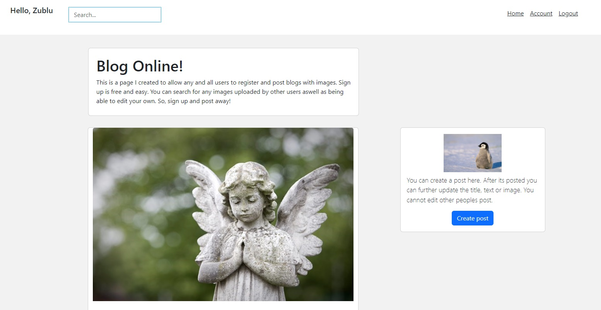

# UX
I've created a website called 'Blog online".
This is a reddit style website where users can sign up and post/blog.
You can create a title, body(description) and upload images.
You can update any images you have personally uploaded (you cannot change other users posts).

Anyone can create an account for free and easily with the register button and immidately start posting;

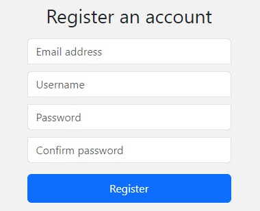

 

There are a lot of validation checks. Mainly when creating accounts or changing account settings.
So when you register an account if a different user has the same name or is using that specific email you wont be able to use it also.

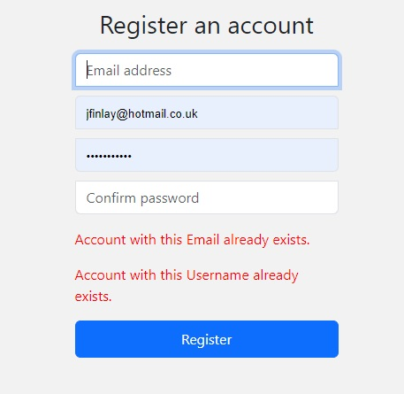

 

# Features

__Existing Features__

A fully functioning frontend that includes;
- Whilst logged in;
	- Home page
	- Account (settings)
	- Logout

- Whilst logged out;
	- Home page
	- Login
	- Register

 

## __While logged in__

When logged in you can post/blog with a title, description and an image.
You can further update your post (with success messages).
You can change your account settings such as change email/username or password.
Everything is in the top right nav bar;

__Create post__

There are two ways to create a post (depending on screen size).
There is only ever 1 way to post at any time.
You can create a post/blog with a title, description and an image;

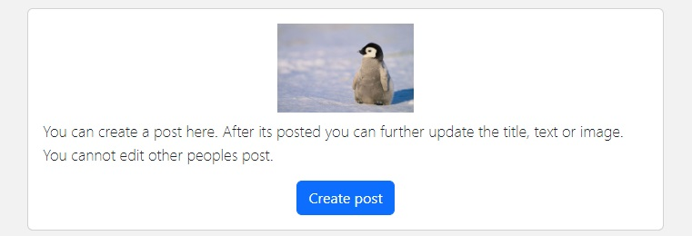

 

__Edit post__

You can edit any post YOU have created and no other users;

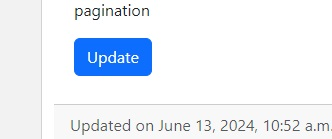

 

__Change password__

You can update your email, and change password in accounts menu;

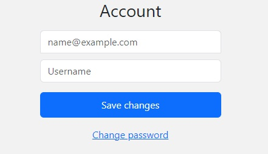

 

__Users posts__

You can view all your uploaded posts as a list on accounts. You can enter the posts and it will lead to 'update' function too.
Currently you can only view your personal uploads this way. But when and if I create it further to add friends I will add a function to enable users to see friends posts in a similar fashion.

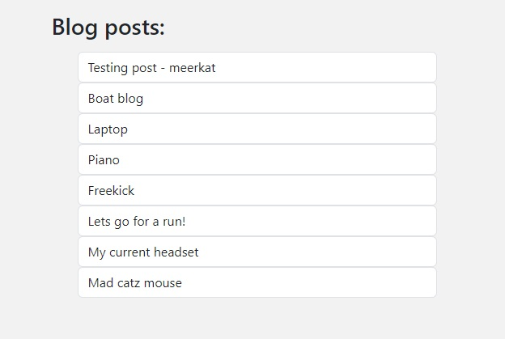

 

## __While logged out__

While logged out my website is mainly made to push people to register and log in.
There is an authentication check before trying to post or changing account settings.
You can register/sign up while logged out or alternatively you can login if you've created an account.
You can still always see other users posts.

 

__Reset password__

You can reset your password if forgotten. When logged out there is a reset password by login 
(currently sends it into my terminal and not directly through email).

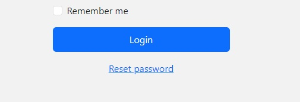

 

## __While logged in or out__

__Search bar__

There is a fully functioning search bar at the top of the page. I've set it's position to fixed so it will follow the user as they scroll.
You can search for any image that's been posted and will recieve a 'nothing found' message if there is no posts that match the search.

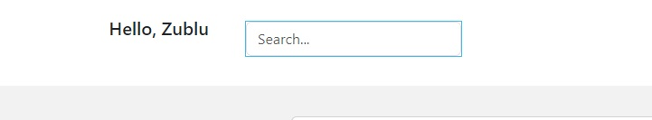

 

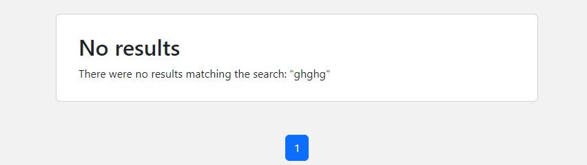

 

__Pagination__

At the bottom of the page I've implemented a Pagination system and set it currently to 3 images per page.
When you hit the bottom of the page you can jump one or more pages at a time or completely jump to the last page.
If there was hundreds/thousands of posts I would increase that number, but for now as a test I thought 3 was fine.

 

__Validation checks__

The validation checks are when logging in to check credentials are correct.
Also when registering an account to check other users don't have the same name
lastly when registering an account to check the password isn't too weak.

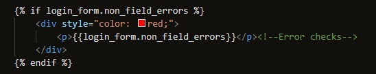

 

Theres also a password check. When you change your password it will ensure you repeat your new password twice (otherwise it will not work).
Password '1' and '2' MUST be the same;

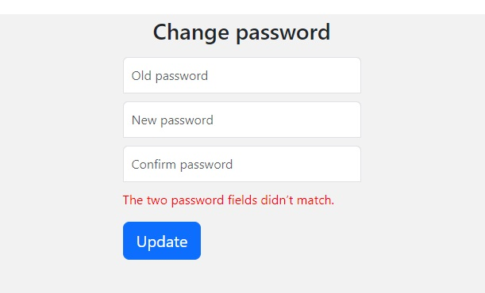

 

# Features Left to Implement

I have a few ideas I would love to add to this project such as:

	- A like button on posts
	- A comments section on posts 
	- A friends list/add friends

Following closely to friends list (also mentioned above) I would push the ability to be able to see all of your friends posts in a list such as you can your own.

I think these features would add a great touch to the website making it a lot more interactive for users and would bring more to the blog website.

 

# Testing

I've tested blog online on multiple browers such as Firefox/Chrome and Microsoft edge. As well as my android phone using "Samsung internet".
To my current knowledge there are no bugs on any device or internet browser - although I'm still yet to test fully on an ipad/tablet.
The website is fully adaptable to all devices and screen sizes.

- Firefox
  - Script works as intended

- Chrome
  - Script works as intended

- Microsoft edge
  - Script works as intended

## Mobile testing

- Firefox (mobile)
  - Script works as intended

- Chrome (mobile)
  - Script works as intended

- Microsoft edge (mobile)
  - Script works as intended

# Validator Testing

All checks are passed and it's running smoothly

# Bugs
I've been lucky and not encountered many bugs whilst making this project.
The main bug I've encountered is images not loading correctly while debug is set to True.
I believe it to be happening because my images are being stored onto my ide and not online.
Further tests will need to pursue before potentially running in production mode.

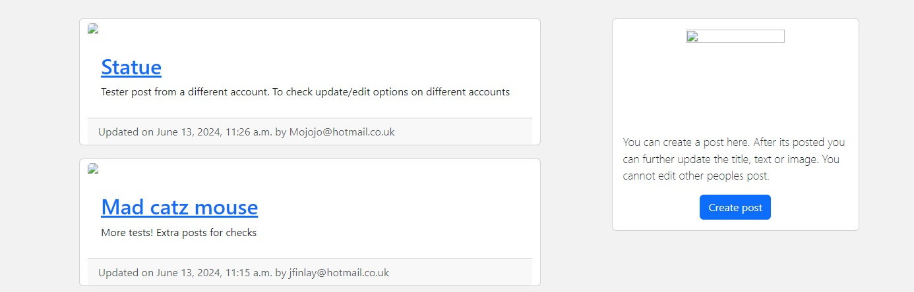

# Deployment

- The site was deployed to GitHub pages. The steps to deploy are as follows:
  - In the GitHub repository, navigate to the Settings tab
  - From the source section drop-down menu, select the Master Branch
  - Once the master branch has been selected, the page will be automatically refreshed with a detailed ribbon display to indicate the successful deployment.

The live link can be found here - <https://github.com/Jordan-Finlay/blog_online>

## Local deployment

- I've downloaded a copy of my wedding checker script onto my computer and am able to access it through local deployment to change and mess around with the overall code and layout/structure for better user experience. I've also installed python that allows me to work on my code as if it was running through code anywhere.

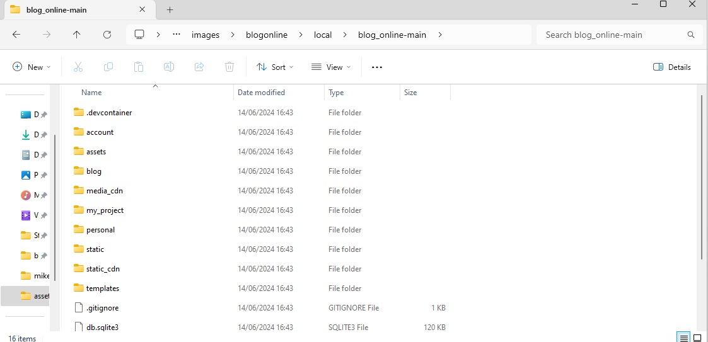

# Credits

__Content__

- I used google for some images and pixabay for a few others - https://pixabay.com/images/search/logo/
- Other than that, I've not used any third parties for any logos/design/pictures etc

